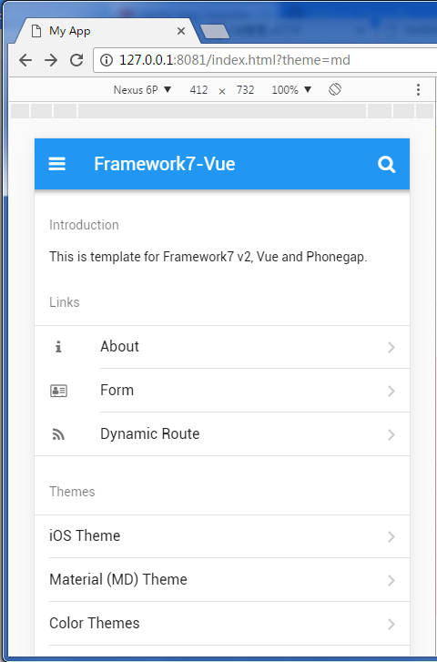

# cordova-template-framework7-vue-webpack (v2)
fit for Framework7 v2
> original one (for F7 v1): https://github.com/centrual/cordova-template-framework7-vue-webpack



## Install
```
git clone to your computer
npm install
phonegap run browser -- --lr
# phonegap platform add android
```

Check your app at web browser: http://localhost:8081

## Build
```
phonegap build --release
```
the output is in `/www` directory.

For more information about build: [Cordova Android Platform Guide](https://cordova.apache.org/docs/en/latest/guide/platforms/android/index.html)

## Project Structure
```
src - Source files are here. Mostly your target is this directory.
src/assets/static - Your static assets like images, css, fonts, json, js, sass is here.
src/assets/static/css - put custom app CSS styles here. Don't forget to import them in main.js
src/pages - app .vue pages
src/main.js - main app file where you include/import all required libs and init app
src/routes.js - app routes
src/app.vue - main app structure/component
```
